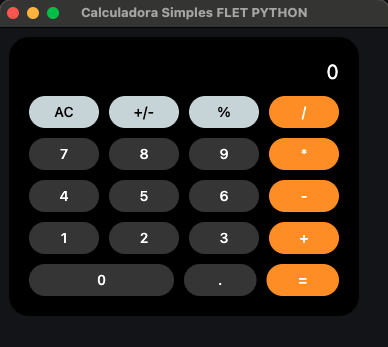

# Aplicación Flet - Calculadora

## Descripción

Aplicación de escritorio desarrollada con **Flet** que proporciona una interfaz de usuario simple con una página de bienvenida. Esta aplicación sirve como base para construir aplicaciones más complejas con componentes visuales como contenedores, textos y formularios.

## Requisitos

- Python 3.8 o superior
- Flet 0.84.0 o superior

## Instalación

### Con entorno virtual

```bash
python3 -m venv venv
source venv/bin/activate  # En Windows: venv\Scripts\activate
pip install flet
```

## Ejecución de la aplicación

### Opción 1: Ejecución directa

```bash
flet run
```

### Opción 2: Ejecución como aplicación de escritorio

```bash
flet run main.py
```

### Opción 3: Ejecución como aplicación web

```bash
flet run --web
```

Para más detalles sobre cómo ejecutar la aplicación, consulta la [Guía de Inicio Rápido](https://flet.dev/docs/).

## Estructura del proyecto

```
fletApp/
├── main.py          # Punto de entrada de la aplicación
├── index.py         # Definición del componente principal
├── README.md        # Este archivo
├── assets/          # Carpeta de recursos (imágenes, etc.)
└── venv/            # Entorno virtual de Python
```

## Vista previa de la aplicación



La aplicación muestra una interfaz limpia y sencilla con un contenedor que incluye un saludo inicial y un título personalizado.

## Compilación de la aplicación

### Android

```bash
flet build apk -v
```

Para más detalles sobre empaquetado y firma de `.apk` o `.aab`, consulta la [Guía de Empaquetado para Android](https://flet.dev/docs/publish/android/).

### iOS

```bash
flet build ipa -v
```

Para más detalles sobre empaquetado y firma de `.ipa`, consulta la [Guía de Empaquetado para iOS](https://flet.dev/docs/publish/ios/).

### macOS

```bash
flet build macos -v
```

Para más detalles sobre la compilación de paquetes para macOS, consulta la [Guía de Empaquetado para macOS](https://flet.dev/docs/publish/macos/).

### Linux

```bash
flet build linux -v
```

Para más detalles sobre la compilación de paquetes para Linux, consulta la [Guía de Empaquetado para Linux](https://flet.dev/docs/publish/linux/).

### Windows

```bash
flet build windows -v
```

Para más detalles sobre la compilación de paquetes para Windows, consulta la [Guía de Empaquetado para Windows](https://flet.dev/docs/publish/windows/).

### Web

```bash
flet build web -v
```

Para más detalles sobre la compilación de aplicaciones web, consulta la [Guía de Empaquetado Web](https://flet.dev/docs/publish/web/).

## Recursos

- [Documentación oficial de Flet](https://flet.dev/docs/)
- [Ejemplos de Flet](https://flet.dev/docs/examples/)

## Enlaces

- **Repositorio:** [GitHub](https://github.com/12345star/flet-python-calculator)
- **Página Web:** [GitHub Pages](https://12345star.github.io/flet-python-calculator)

## Licencia

Este proyecto es de código abierto y puede ser utilizado libremente.

